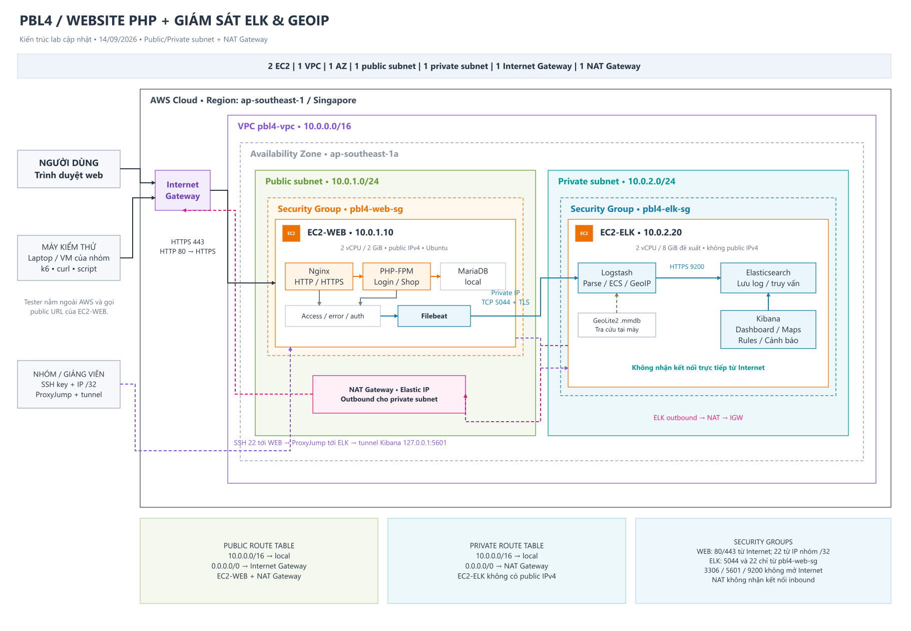

# Khung báo cáo PBL4 sau xác nhận của giảng viên

Trạng thái: khung nội dung đã thống nhất. Các ô kết quả phải điền từ triển khai và đo thực tế.

## 1. Mục tiêu và phạm vi

Xây dựng website PHP tối giản làm nguồn access/error/auth log, tập trung xử lý bằng Filebeat–Logstash–Elasticsearch, GeoIP cấp quốc gia và Kibana dashboard/cảnh báo. Không thanh toán/nạp tiền. Phát hiện bằng bốn rule/ngưỡng, không yêu cầu Machine Learning.

## 2. Kiến trúc

Một VPC, một AZ, public subnet cho WEB/NAT và private subnet cho ELK. Hai EC2; MariaDB local; ELK single-node. Filebeat dùng TLS qua private IP; quản trị Kibana bằng SSH ProxyJump và tunnel. Đính kèm E1/E2 với ID/IP thực khi triển khai.

## 3. Dữ liệu và xử lý

Đính kèm CONTRACT, mẫu access JSON, auth JSON và error text. Giải thích tách dataset, parsing, mapping geo_point và quốc gia. Đối chiếu cùng request ID từ log gốc tới document. Dữ liệu synthetic đánh dấu, tách khỏi số liệu thật.

## 4. Rule và dashboard

Đính kèm E9 baseline, E10 cấu hình R1–R4. Giải thích cửa sổ, ngưỡng, lịch đánh giá và hạn chế lặp. Dashboard gồm request theo thời gian, top IP/URI, login success/fail, map/top country và bảng cảnh báo.

## 5. Kết quả thực nghiệm

| Hạng mục | Kết quả | Bằng chứng |
|---|---|---|
| TLS, ba dataset và mapping | Chưa đo | E3/E4/E5 |
| GeoIP quốc gia và lookup failure | Chưa đo | E6/E7 |
| Dashboard | Chưa nghiệm thu | E8 |
| R1–R4 dương/âm/biên | Chưa đo | E11/E12 |
| Độ trễ ingest | Chưa đo | E13a |
| Độ trễ hiển thị Kibana | Chưa đo | E13b |
| Độ trễ cảnh báo | Chưa đo | E13c |
| Chi phí và teardown | Chưa đo | E14/E15 |

Ghi số mẫu, cách đo, median/p95/max, false positive và các lỗi gặp. Không dùng ảnh mô phỏng làm bằng chứng triển khai thật.

## 6. Giới hạn và kết luận

Một AZ và single-node chưa chịu lỗi cao; GeoIP không xác định GPS; rule có false positive/negative; demo không đại diện Internet thực. Kết luận sau khi điền số đo và đối chiếu từng yêu cầu với bằng chứng E16. Chức năng mở rộng chỉ làm sau khi cốt lõi đạt nghiệm thu.
